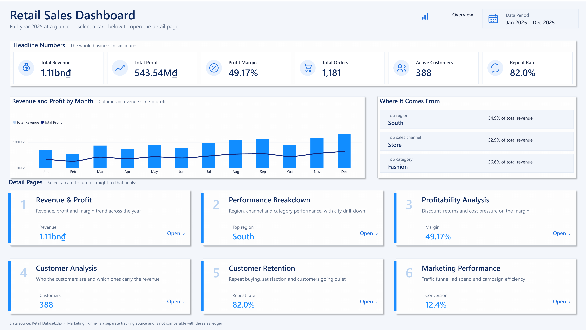
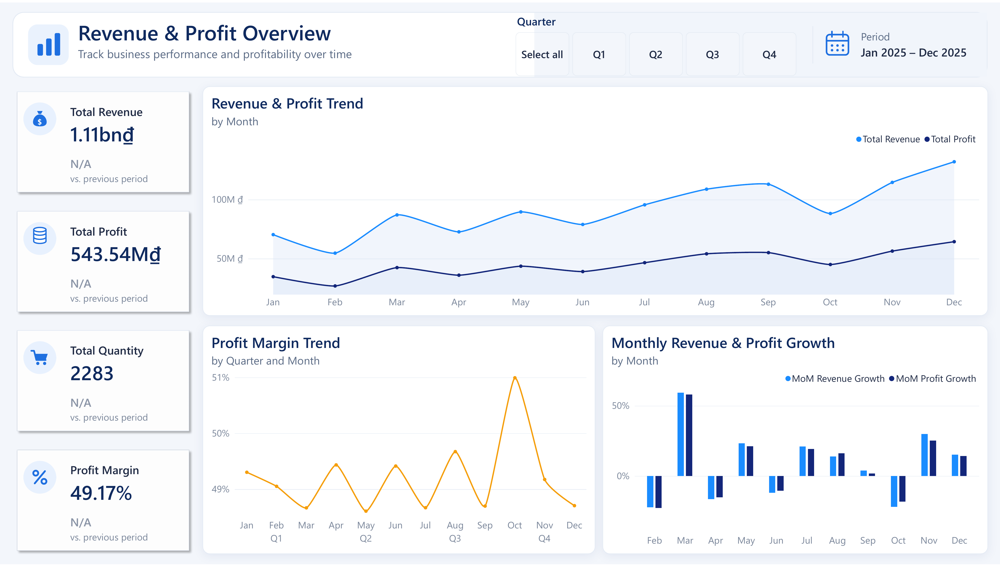
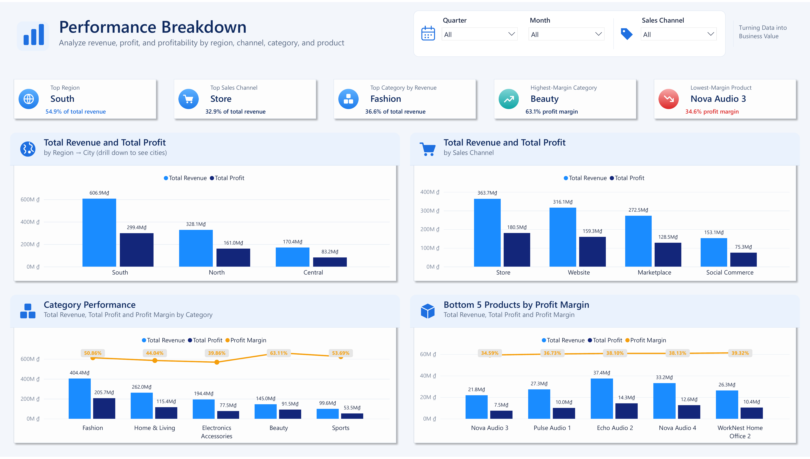
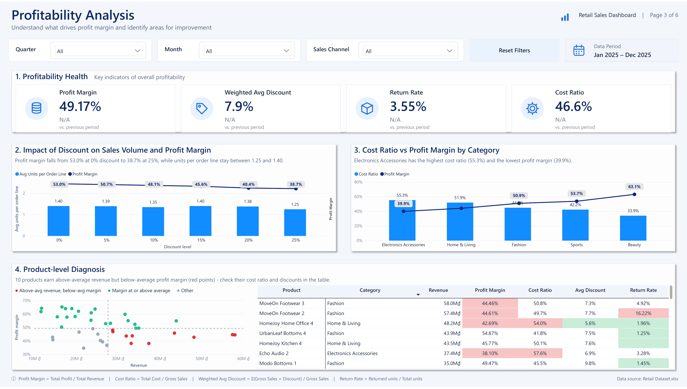
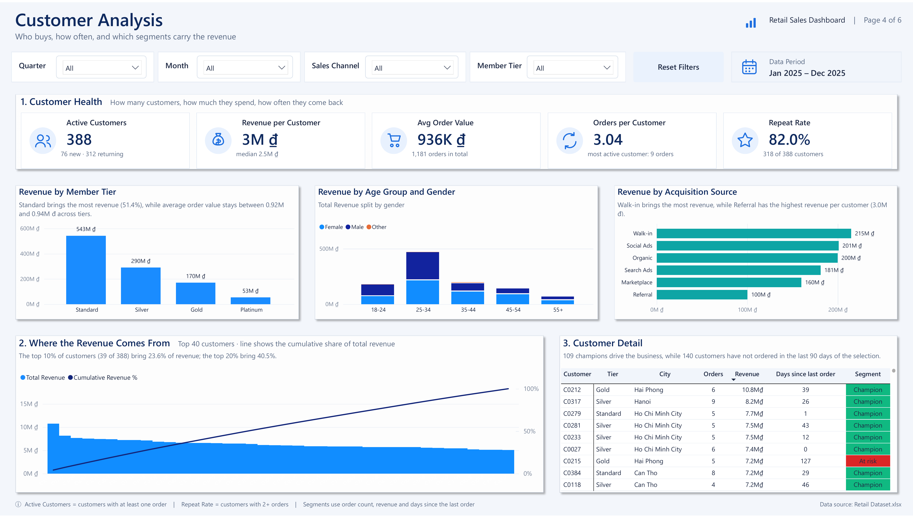
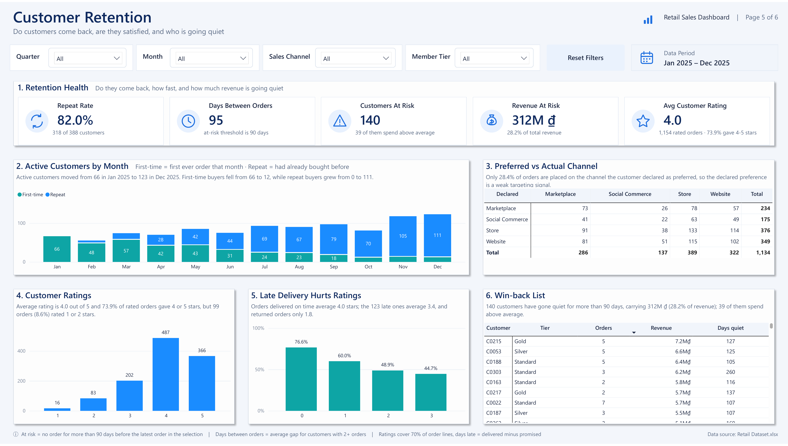
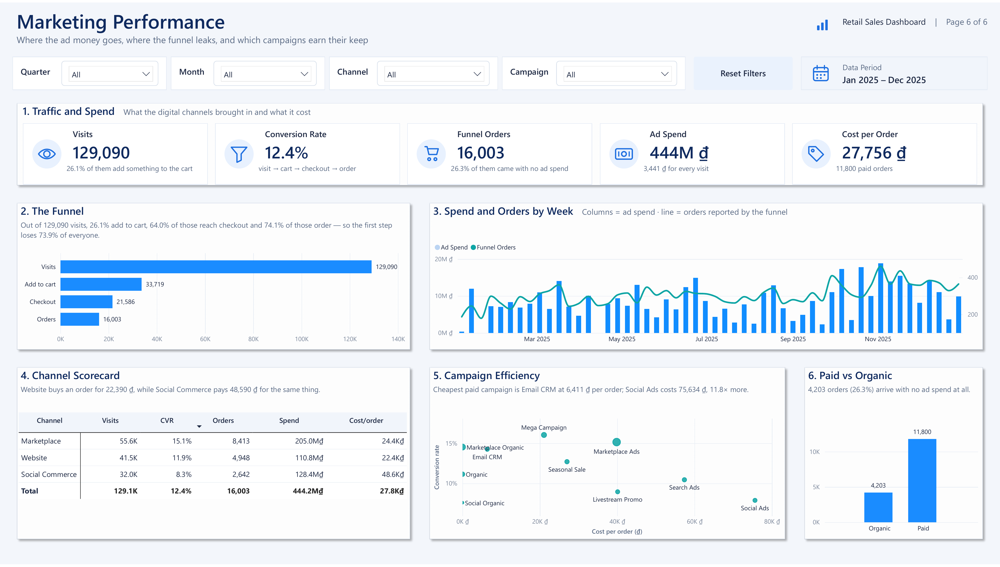

# Retail Sales Dashboard — Power BI

A seven-page Power BI report built on a year of retail transactions, covering revenue and
profitability, customer behaviour, retention and digital marketing efficiency.

The report is authored in **PBIP / PBIR format** (JSON page definitions + TMDL semantic model),
so every page, measure and style rule in this repository is plain text and reviewable in a diff.



---

## The data

| | |
|---|---|
| Source | `Retail Dataset.xlsx` — 5 sheets (Sales, Customers, Products, Marketing_Funnel, Data_Dictionary) |
| Period | 1 Jan 2025 – 31 Dec 2025 |
| Grain | one row per order line |
| Volume | 1,650 order lines → 1,181 orders, 2,283 units, 388 identified customers, 40 products |
| Marketing | 156 weekly rows across 3 digital channels and 10 campaigns |

**Headline figures:** 1.11bn ₫ revenue · 543.5M ₫ gross profit · 49.17% margin ·
936K ₫ average order value · 3.6% of order lines returned.

### Data model

A star schema with `SalesTable` as the fact table, joined to `CustomersTable`, `ProductsTable`
and a dedicated `DateTable`. `MarketingFunnelTable` is related to the date table only — its
volumes do not reconcile with the sales ledger (see *Data quality* below), so it is never mixed
with revenue. `FunnelStage` is a small disconnected table that drives the funnel chart.

Two calculated columns support the customer analysis:

- `First_Purchase_Date` — the date of each customer's first ever order, used to split first-time
  buyers from returning ones.
- `Funding` — flags each marketing row as Paid or Organic.

132 DAX measures, grouped into display folders per page.

---

## Pages

| # | Page | Question it answers |
|---|---|---|
| — | **Overview** | Where does the business stand, and where do I go for detail? |
| 1 | **Revenue & Profit** | How did revenue, profit and margin move through the year? |
| 2 | **Performance Breakdown** | Which regions, channels and categories carry the business? |
| 3 | **Profitability Analysis** | What is eating the margin — discounts, returns or cost? |
| 4 | **Customer Analysis** | Who are the customers and which ones carry the revenue? |
| 5 | **Customer Retention** | Do they come back, are they satisfied, and who is going quiet? |
| 6 | **Marketing Performance** | Where does the ad budget go and what does it buy? |

### 1 · Revenue & Profit


### 2 · Performance Breakdown


### 3 · Profitability Analysis


### 4 · Customer Analysis


### 5 · Customer Retention


### 6 · Marketing Performance


---

## Key findings

**1. Revenue is less concentrated than the usual 80/20 rule suggests.**
The top 10% of identified customers bring 23.6% of revenue and the top 20% bring 40.5%.
There is no small set of whales to protect — the base itself is the asset.

**2. The customer base flipped from acquisition to repeat business during the year.**
First-time buyers fell from 66 in January to 12 in December, while repeat buyers grew from 0 to
111. Growth in the second half came almost entirely from customers who had already bought.

**3. Late delivery is the clearest driver of dissatisfaction.**
The share of orders rated 4–5 stars drops from 76.6% when delivery is on time to 60.0%, 48.9%
and 44.7% at one, two and three days late. Returned orders average 1.79 stars against an overall
average of 3.96.

**4. 140 customers worth 312M ₫ have gone quiet.**
That is 28.2% of revenue sitting with customers who have not ordered in more than 90 days, and
39 of them spend above average — a concrete win-back list rather than an abstract churn number.

**5. The membership tier explains nothing.**
Revenue per customer is flat across tiers (2.42M–2.76M ₫) and so is satisfaction (3.91–4.00
stars). Platinum members actually spend 12% less per head than Standard ones. The tier is a label,
not a behavioural segment.

**6. The declared preferred channel is a weak targeting signal.**
Only 28.4% of orders are placed on the channel the customer declared as preferred.

**7. Paid marketing efficiency varies by a factor of twelve.**
Social Ads costs 75,634 ₫ per order against 6,411 ₫ for Email CRM. Social Commerce is the weakest
channel at every funnel step (8.3% conversion versus 15.1% for Marketplace) yet costs twice as
much per order. Meanwhile the three organic campaigns deliver 26.3% of funnel orders at zero
advertising cost.

**8. The funnel leaks hardest at the very first step.**
Of 129,090 visits, only 26.1% add anything to the cart. Once an item is in the cart, 64.0% reach
checkout and 74.1% of those convert — the later stages are healthy.

---

## Data quality notes

Two issues were found in the source data and handled explicitly rather than quietly:

- **Marketing_Funnel does not reconcile with the sales ledger.** It reports 16,003 orders against
  1,181 in Sales — a factor of 13.5. The two sources are never joined; the marketing page carries a
  visible warning and is read for rates, mix and relative efficiency only, never for revenue or ROAS.
- **68 order lines carry no Customer_ID** (48.6M ₫, 4.4% of revenue). Power BI groups them into a
  single blank customer that would outrank every real one, so every customer-level measure excludes
  unidentified rows while revenue totals still include them.

---

## How it was built

- **PBIP / PBIR authoring.** Pages are produced by deterministic Node generators that write the
  `visual.json` files, with stable ids derived from a hash of the visual key, then checked with the
  PBIR schema validator (0 errors, 0 warnings).
- **TMDL semantic model.** Measures, calculated columns and relationships are edited as text.
- **DAX.** RFM-style segmentation, first-purchase cohort analysis, Pareto cumulative share,
  funnel conversion rates, previous-period deltas, and narrative measures that write a sentence of
  commentary under each chart from the data itself.
- **One design system.** A single palette and a shared set of components (KPI tile, panel, section
  header, filter row) across all seven pages; revenue is always blue, profit navy, margin amber, and
  red is reserved for warnings.
- **Navigation.** The overview page carries six cards that jump straight to the matching detail page.

## Repository layout

```
dash.pbip                    Power BI project file — open this
dash.Report/                 report definition (pages, visuals, theme, images)
dash.SemanticModel/          TMDL model: tables, measures, relationships
Retail Dataset.xlsx          source data
docs/img/                    page screenshots
```

## Opening the report

Open `dash.pbip` with Power BI Desktop (Developer mode / PBIP enabled). The workbook path is
stored in the model, so point the query to your own copy of `Retail Dataset.xlsx` and refresh.
